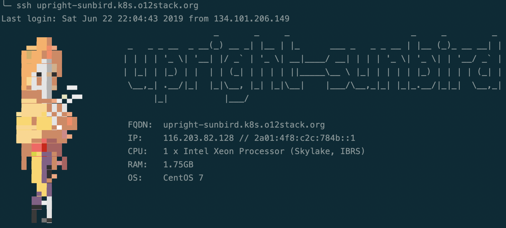

# Generic workshop cluster setup


This repository holds resources to set up a general workshop
cluster. Remove the software installment hassle on local
laptops and use powerful cloud servers for your workshop instead.
Participants:

* work on their own server in _Hetzner_ cloud
* edit the workshop files in the browser, in their
  local IDE or in the Terminal
* install, configure and launch workshop related software



We use this setup for our [Observability Workshops](https://github.com/observabilitystack/k8s-observability-workshop).

## TL;DR

Install necessary software:

```bash
brew install ansible terraform figlet
```

To get things up and running:

```bash
cd infrastructure/cluster && tf apply
tf output -raw ansible_inventory > ../../inventory/all.yaml && cd ../..
ansible-playbook site.yaml
```

## Documentation

* [Connecting to a server](docs/connecting.md)
* [Technical foundatations](docs/technical_foundations.md)
* [Customizing the Cluster for your workshop](docs/customizing_for_your_workshop.md)
* [Setting up the Cluster](docs/setting_up_the_cluster.md)

## Questions?

Do not hesitate to contact us by E-Mail, Twitter or [Slack](https://o12stack.slack.com/) if you have any questions:

👨‍💻 | Torsten Köster | Nikolaus Winter
---|------------ | -------------
🌐 | [thiswayup.de](https://www.thiswayup.de) | [nikolauswinter.de](https://www.nikolauswinter.de)
📧 | [tbk@thiswayup.de](mailto:tbk@thiswayup.de) | [training@nikolauswinter.de](mailto:training@nikolauswinter.de)
🐦 | [@tboeghk](https://twitter.com/tboeghk) | [@backstreetkiwi](https://twitter.com/backstreetkiwi)
