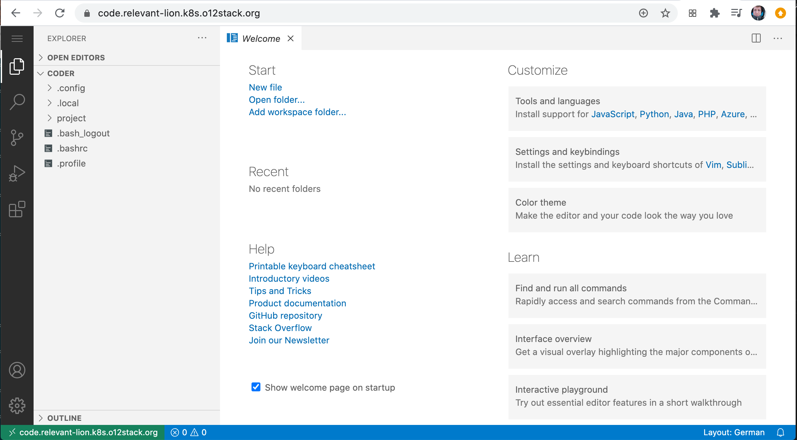
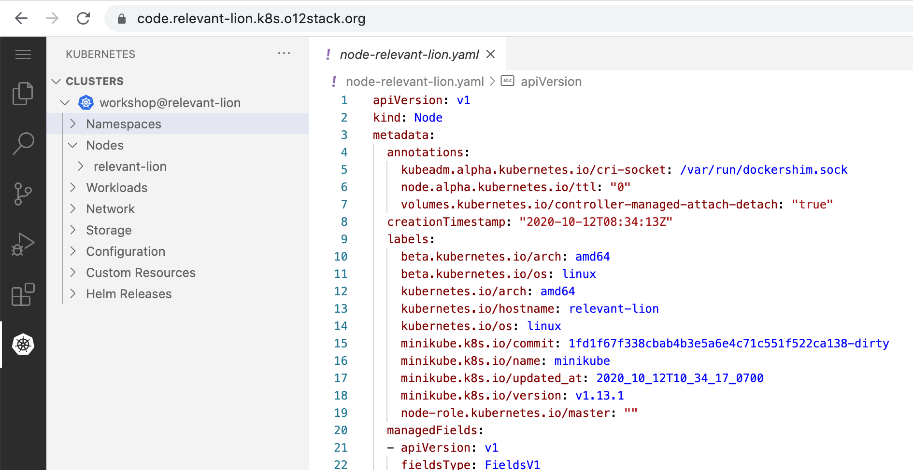
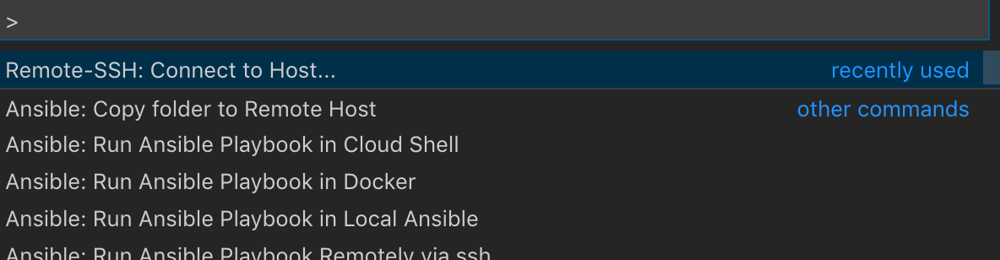
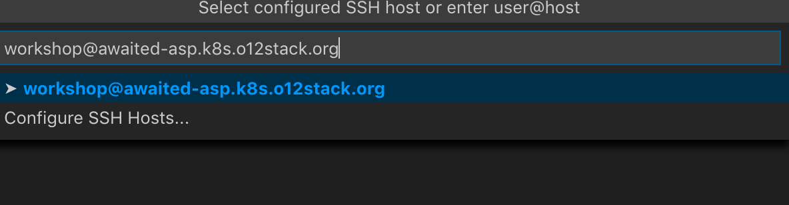
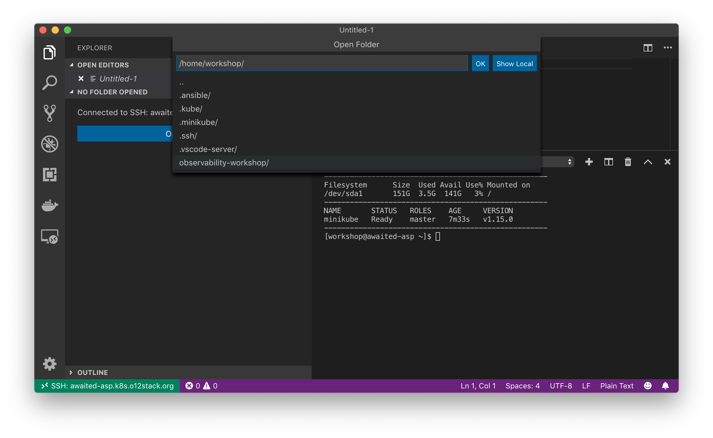

# Connecting to a workshop server

Choose your weapon how to connect to your workshop server
instance.

### Using a Terminal

You should be able to SSH directly into the server if you provided
your SSH key to us beforehand

```
ssh workshop@<SERVERNAME>.k8s.o12stack.org
```


On the server you find all sort of editors. If something is missing,
you can `sudo dnf install <PACKAGE>` anything you like.

### Using a Browser

An instance of [vscode-server](https://github.com/cdr/code-server) is
running at [code.SERVERNAME.k8s.o12stack.org](https://code.SERVERNAME.k8s.o12stack.org). You find the _workshop_ user's home directory mounted in
`./project`



Feel free to install the extensions you need, e.g. the _Kubernetes_ extension. To gain control over the running Kubernetes cluster, add
`./project/.kube/config` as existing Kubeconfig to your clusters.



### Using `k9s`

You can either SSH into your server and use _k9s_ on the Terminal or
use _k9s_ locally. Copy the Kubeconfig to your local machine:

```
scp workshop@SERVERNAME.k8s.o12stack.org:/home/workshop/.kube/config ~/.kube/config-SERVERNAME
KUBECONFIG=~/.kube/config-SERVERNAME k9s
```

### Using a local VSCode

To connect to your Kubernetes training cluster, we recommend using Visual 
Studio Code and the remote SSH plugin. Hit `F1` and start typing 
`Remote SSH`. Select `Remote SSH: Connect to Host ...`



During the workshop, you connect as the SSH user `workshop`. Connect
to your assigned server, e.g. `workshop@opawaited-asp.k8s.o12stack.org`. 



VSCode opens a remote SSH shell for your convenience. Click `Open a folder`
and select `/home/workshop/observability-workshop` to gain access to the
workshops resources.



## Questions?

Do not hesitate to contact us by E-Mail, Twitter or [Slack](https://o12stack.slack.com/) if you have any questions:

👨‍💻 | Torsten Köster | Nikolaus Winter
---|------------ | -------------
🌐 | [thiswayup.de](https://www.thiswayup.de) | [nikolauswinter.de](https://www.nikolauswinter.de)
📧 | [tbk@thiswayup.de](mailto:tbk@thiswayup.de) | [training@nikolauswinter.de](mailto:training@nikolauswinter.de)
🐦 | [@tboeghk](https://twitter.com/tboeghk) | [@backstreetkiwi](https://twitter.com/backstreetkiwi)